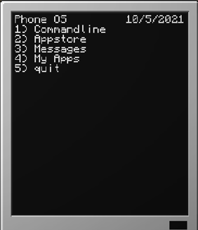
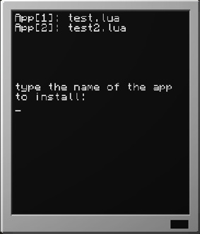

# Minecraft Phone OS readme

This is an open source phone operating system However it is not an ordinary operating system.

This is system is two parts the OS(the file called Phone.lua) which is for the pocket computer on minecraft and the Server(all of the rest).

The OS serves two purposes to provide a readable device for someone who cannot navigate the computer craft shell and a nice and simple message and game service.

The server is to  allow users to communicate with each other and make their own apps and download apps (the lua files in the apps folder).

# A quick walkthrough of the OS

the OS is a text based interface with multiple options.



Each option may be accessed by entering the corresponding number.

# The CommandLine

The OS contains its own command line this is mainly for making manual requests to the server but i plan on adding functions that work like mkdir.

server commands all start with 'request-' to show the server that it is a request.

Current commands are request-ip , request-date , request-listapps , request-app+[appname].

most of the commands are also used when accessing the menu for example: request-date is used for the date on the main menu and request-listapps is used for the app store.
Command line functions for the client is a WIP so far commands only work for the web server


# The Applications

Apps are stored in the apps folder of the server there the host can put their own lua files.

Other users can see the files there by going to the Appstore on the phone where it lists all the apps in the directory(example below).



There is a certain requirement for applications so it is compatible with the OS. all applications must contain:

```
ender = read()
shell.run("startup")
```

where it should close the application. This is so when the application closes instead of returning to the computercraft shell it returns to the Phone OS.

# The Messaging system

This is currently unreleased and is still a work in progress but the concept is to make a chat room where the user can send messages to their peers via the server.

# The Server

The server is the main hub for the requests used to get the date a list of apps and for users to be able to download apps to their Minecraft phone

The server is based on the node package 'ws'

The server currently can handle requests for:

list of all apps in the ./apps directory

giving users unique session IDs to use for technological things

sending the application files to the users

basic real time date system

The server is planned to have a chat room to allow users in minecraft to chat to each other over servers!!!!!

The server also currently has basic error handling included this handling sends an error message to the user telling them to try later or contact a server admin.


# Final notes

This project is open source so feel free to take some of my code and alter it for use with whatever you want

Small roadmap:

Cross minecraft server messaging.

Uploading apps via phones.

Private messages.

Turtle Control using UUID given by server.
